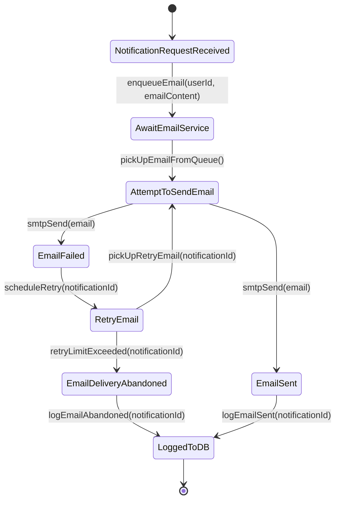

# Email Notification System Implementation Plan

This document outlines the plan for implementing an email notification system for user registration in the Triply API.

## 1. Project Setup and Dependencies:

*   **Add JavaMail dependency:** Add the `spring-boot-starter-mail` dependency to the `pom.xml` file. This dependency provides the necessary classes for sending emails using JavaMail.
*   **Configure SMTP server:** Configure the SMTP server properties in the `application.yml` or `application-dev.yml` file. This includes the host, port, username, and password of the SMTP server.

## 2. Email Sending Service:

*   **Create an EmailService interface:** Define an `EmailService` interface with a method for sending emails.
*   **Create an EmailServiceImpl class:** Implement the `EmailService` interface using the `JavaMailSender` class. This class will handle the actual email sending logic.

## 3. User Registration Logic:

*   **Modify the registration endpoint:** In the `AuthResource.java` file, modify the registration endpoint to call the `EmailService` after a new user is successfully registered.
*   **Create an email template:** Create a simple email template (e.g., a Thymeleaf template) for the registration confirmation email. This template will contain the message to be sent to the user.

## 4. Testing:

*   **Test the email sending functionality:** Create a unit test for the `EmailService` to ensure that it can send emails correctly.
*   **Test the registration endpoint:** Test the registration endpoint to ensure that an email is sent to the user after successful registration.

## 5. Error Handling:

*   **Implement error handling:** Implement error handling in the `EmailService` to handle cases where the email sending fails. This could involve logging the error and/or retrying the email sending.

## Diagrams:

### State Diagram:



### Sequence Diagram:

```mermaid
sequenceDiagram
    participant NotificationService
    participant EmailService
    participant Database
    participant SMTPServer

    NotificationService->>EmailService: sendEmailNotification(userId, emailContent)
    EmailService->>Database: retrieve UserEmail from userId
    Database-->>EmailService: UserEmail
    EmailService->>EmailService: Format Email (Subject, Body, etc.)
    EmailService->>SMTPServer: Send Email to UserEmail

    alt Email Sent Successfully
        SMTPServer-->>EmailService: Email Accepted
        EmailService-->>NotificationService: Success
        EmailService->>Database: Update Notification Status
        Database-->>EmailService: Updated
    else Email Sending Failed
        SMTPServer-->>EmailService: Error: Delivery Failed
        EmailService-->>NotificationService: Failure
        EmailService->>Database: Update Notification Status
        Database-->>EmailService: Updated
    end